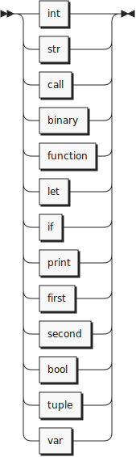
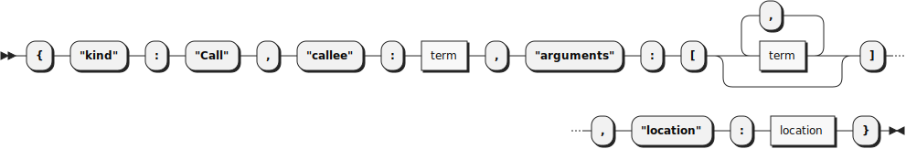
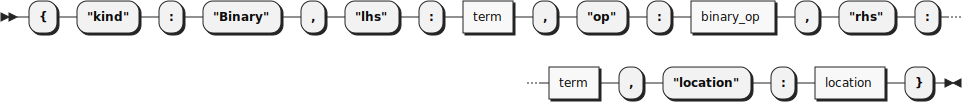
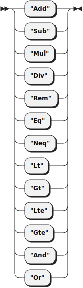
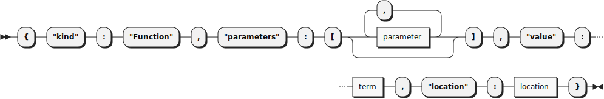
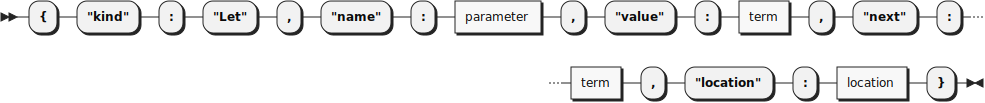
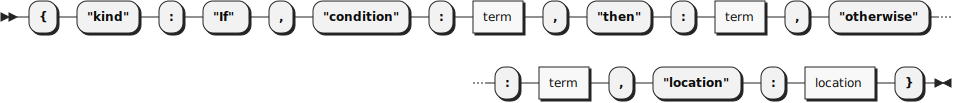
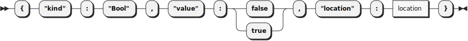
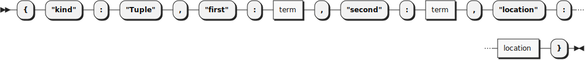

**file:**


```
file     ::= '{' '"name"' ':' STRING ',' '"expression"' ':' term ',' '"location"' ':' location '}'
```

**term:**



```
term     ::= int
           | str
           | call
           | binary
           | function
           | let
           | if
           | print
           | first
           | second
           | bool
           | tuple
           | var
```

referenced by:

* binary
* call
* file
* first
* function
* if
* let
* print
* second
* tuple

**location:**


```
location ::= '{' '"start"' ':' INT ',' '"end"' ':' INT ',' '"filename"' ':' STRING '}'
```

referenced by:

* binary
* bool
* call
* file
* first
* function
* if
* int
* let
* parameter
* print
* second
* str
* tuple
* var

**int:**


```
int      ::= '{' '"kind"' ':' '"Int"' ',' '"value"' ':' INT ',' '"location"' ':' location '}'
```

referenced by:

* term

**str:**


```
str      ::= '{' '"kind"' ':' '"Str"' ',' '"value"' ':' STRING ',' '"location"' ':' location '}'
```

referenced by:

* term

**call:**



```
call     ::= '{' '"kind"' ':' '"Call"' ',' '"callee"' ':' term ',' '"arguments"' ':' '[' ( term ( ',' term )* )? ']' ',' '"location"' ':' location '}'
```

referenced by:

* term

**binary:**



```
binary   ::= '{' '"kind"' ':' '"Binary"' ',' '"lhs"' ':' term ',' '"op"' ':' binary_op ',' '"rhs"' ':' term ',' '"location"' ':' location '}'
```

referenced by:

* term

**binary_op:**



```
binary_op
         ::= '"Add"'
           | '"Sub"'
           | '"Mul"'
           | '"Div"'
           | '"Rem"'
           | '"Eq"'
           | '"Neq"'
           | '"Lt"'
           | '"Gt"'
           | '"Lte"'
           | '"Gte"'
           | '"And"'
           | '"Or"'
```

referenced by:

* binary

**function:**



```
function ::= '{' '"kind"' ':' '"Function"' ',' '"parameters"' ':' '[' ( parameter ( ',' parameter )* )? ']' ',' '"value"' ':' term ',' '"location"' ':' location '}'
```

referenced by:

* term

**parameter:**


```
parameter
         ::= '{' '"text"' ':' STRING ',' '"location"' ':' location '}'
```

referenced by:

* function
* let

**let:**



```
let      ::= '{' '"kind"' ':' '"Let"' ',' '"name"' ':' parameter ',' '"value"' ':' term ',' '"next"' ':' term ',' '"location"' ':' location '}'
```

referenced by:

* term

**if:**



```
if       ::= '{' '"kind"' ':' '"If"' ',' '"condition"' ':' term ',' '"then"' ':' term ',' '"otherwise"' ':' term ',' '"location"' ':' location '}'
```

referenced by:

* term

**print:**


```
print    ::= '{' '"kind"' ':' '"Print"' ',' '"value"' ':' term ',' '"location"' ':' location '}'
```

referenced by:

* term

**first:**


```
first    ::= '{' '"kind"' ':' '"First"' ',' '"value"' ':' term ',' '"location"' ':' location '}'
```

referenced by:

* term

**second:**


```
second   ::= '{' '"kind"' ':' '"Second"' ',' '"value"' ':' term ',' '"location"' ':' location '}'
```

referenced by:

* term

**bool:**



```
bool     ::= '{' '"kind"' ':' '"Bool"' ',' '"value"' ':' ( 'false' | 'true' ) ',' '"location"'
                  ':' location '}'
```

referenced by:

* term

**tuple:**



```
tuple    ::= '{' '"kind"' ':' '"Tuple"' ',' '"first"' ':' term ',' '"second"' ':' term ',' '"location"' ':' location '}'
```

referenced by:

* term

**var:**


```
var      ::= '{' '"kind"' ':' '"Var"' ',' '"text"' ':' STRING ',' '"location"' ':' location '}'
```

referenced by:

* term

## 
 <sup>generated by [RR - Railroad Diagram Generator][RR]</sup>

[RR]: http://bottlecaps.de/rr/ui