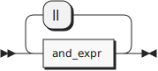
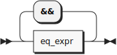
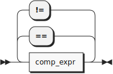
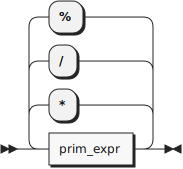

**chunk:**


```
chunk    ::= expr EOF
```

**expr:**



```
expr     ::= and_expr ( '||' and_expr )*
```

referenced by:

* block
* call
* chunk
* prim_expr
* tuple

**and_expr:**



```
and_expr ::= eq_expr ( '&&' eq_expr )*
```

referenced by:

* expr

**eq_expr:**



```
eq_expr  ::= comp_expr ( ( '==' | '!=' ) comp_expr )*
```

referenced by:

* and_expr

**comp_expr:**


```
comp_expr
         ::= add_expr ( ( '<' | '<=' | '>' | '>=' ) add_expr )*
```

referenced by:

* eq_expr

**add_expr:**


```
add_expr ::= mul_expr ( ( '+' | '-' ) mul_expr )*
```

referenced by:

* comp_expr

**mul_expr:**



```
mul_expr ::= prim_expr ( ( '*' | '/' | '%' ) prim_expr )*
```

referenced by:

* add_expr

**prim_expr:**


```
prim_expr
         ::= bool
           | INT
           | STR
           | tuple
           | ( 'if' '(' expr ')' block 'else' )? block
           | ( 'fn' '(' ( IDENT ( ',' IDENT )* )? ')' '=>' | 'let' IDENT '=' expr ';' ) expr
           | ( 'print' | 'first' | 'second' )? '(' expr ')'
           | IDENT call?
```

referenced by:

* mul_expr

**bool:**


```
bool     ::= 'false'
           | 'true'
```

referenced by:

* prim_expr

**tuple:**


```
tuple    ::= '(' expr ',' expr ')'
```

referenced by:

* prim_expr

**block:**


```
block    ::= '{' expr '}'
```

referenced by:

* prim_expr

**call:**


```
call     ::= '(' ( expr ( ',' expr )* )? ')'
```

referenced by:

* prim_expr

## 
 <sup>generated by [RR - Railroad Diagram Generator][RR]</sup>

[RR]: http://bottlecaps.de/rr/ui